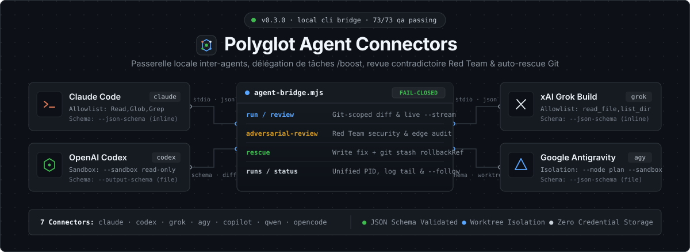
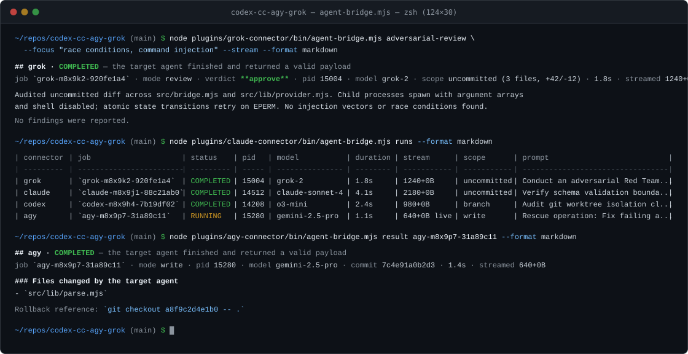

<div align="center">
=======
# Bridge codex - grok - claude - antigravity




<br/>

# ⚡ Polyglot Agent Connectors (`codex-cc-agy-grok`)

### **La Passerelle Multi-Agents Ultime & Solutions `/boost`**
### *The Ultimate Cross-Agent Bridge for Claude Code, OpenAI Codex, xAI Grok & Google Antigravity*

[](package.json)
[](tests/)
[](#📊-cross-agent-provider-comparison-matrix)
[](docs/boost-solutions.md)
[](docs/cross-agent-bridge.md)
[](package.json)
[](LICENSE)

<p align="center">
  <b>Interconnectez vos agents de codage IA préférés dans un maillage autonome, symétrique et sécurisé.</b><br/>
  <b>Déléguez des tâches entre Claude Code, Codex, Grok et Antigravity • Revues Red Team • Auto-Rescue avec Rollback Git garanti.</b>
</p>

[🇫🇷 Présentation en Français](#-passerelle-multi-agents--solutions-boost-en-français) •
[⚡ Solutions /boost](#-solutions-boost--high-velocity-workflows) •
[🖥️ Aperçu Terminal](#️-aperçu-terminal--cli-execution--live-runs) •
[🏛️ Architecture](#-visual-architecture--cross-agent-mesh) •
[📊 Comparatif 7 Agents](#-cross-agent-provider-comparison-matrix) •
[🚀 Installation](#-quickstart--installation) •
[📚 Docs & SEO](#-documentation-guides--ai-indexing)

---

</div>

> **Pourquoi choisir entre Claude Code, Codex, Grok et Antigravity quand vous pouvez orchestrer les quatre simultanément ?**  
> **Polyglot Agent Connectors** fournit la passerelle locale permettant à **Claude Code**, **OpenAI Codex**, **xAI Grok Build**, **Google Antigravity**, **GitHub Copilot**, **Qwen Code** et **OpenCode** de collaborer en pair-à-pair : déléguez des sous-tâches ciblées (`/boost`), lancez des audits de sécurité contradictoires (`adversarial-review`), réparez automatiquement vos tests cassés avec point de sauvegarde Git (`rescue`) et supervisez tous vos agents en direct (`runs`).

---

## 🖥️ Aperçu Terminal — CLI Execution & Live Runs

<div align="center">
  
</div>

---

## 🇫🇷 Passerelle Multi-Agents & Solutions `/boost` (En Français)

### Comment fonctionne la passerelle entre Claude Code, Codex, Grok et Antigravity ?

Chaque agent IA possède des forces uniques. Plutôt que de copier-coller manuellement du code d'un terminal à l'autre, **Polyglot Agent Connectors** installe un pont unifié (`agent-bridge.mjs`), des commandes slash (`/review`, `/adversarial-review`, `/rescue`, `/delegate`, `/handoff`, `/runs`) et des skills dédiés dans chaque environnement hôte :

| Pilier `/boost` | Commande Clé | Objectif & Valeur Ajoutée | Garantie de Sécurité |
| :--- | :--- | :--- | :--- |
| **1. Délégation Multi-Agents** | `run --prompt "<tâche>"` | Déléguer chaque tâche à l'agent optimal : architecture à **Claude Code**, algorithmique complexe à **Codex**, audit rapide à **Grok**, planification à **Antigravity**. | Lecture seule (`review`) par défaut ; isolation OS / liste blanche d'outils. |
| **2. Revue Red Team Contradictoire** | `adversarial-review --focus "<cible>"` | Briser le biais de confirmation en faisant auditer le code d'un agent par un agent concurrent spécialisé en sécurité et cas limites. | Verdict structuré et validé par JSON Schema (`approve`, `needs-attention`, `could-not-review`). |
| **3. Auto-Sauvetage Résilient** | `rescue --error "<log>" --test "<cmd>"` | Réparer automatiquement un build ou des tests unitaires cassés en mode écriture (`write`). | Snapshot Git automatique (`git stash create` → `rollbackRef`) avant toute édition. |
| **4. Supervision Temps Réel** | `runs` & `status <id> --follow` | Surveiller tous les agents actifs en arrière-plan dans un tableau de bord unifié (PIDs, durée live, modèle, flux `stdout`/`stderr`). | Journal d'orchestration `events.ndjson` et ramasse-miettes des processus orphelins. |

---

## 🏛️ Visual Architecture & Cross-Agent Mesh

```text
                     ┌────────────────────────────────────────────────────────┐
                     │                  AUTONOMOUS AGENT HOSTS                │
                     │  Claude Code  •  OpenAI Codex  •  Grok Build  •  Agy   │
                     └───────────────────────────┬────────────────────────────┘
                                                 │  (Slash Commands / Skills / CLI)
                                                 ▼
┌─────────────────────────────────────────────────────────────────────────────────────────────┐
│                          UNIFIED AGENT BRIDGE (src/bridge.mjs)                              │
│                                                                                             │
│  • /boost Delegation Engine             • Red Team Adversarial Review                       │
│  • Git Scope Resolution (Diffs)         • Auto-Rescue Engine (git stash rollbackRef)        │
│  • Cycle Guard (Max Depth 3)            • Multi-Agent Supervision Dashboard (runs/follow)   │
│  • Worktree & OS Sandboxing             • Zero-Credential Leak Safety Model                 │
└──────┬───────────────────────┬───────────────────────┬───────────────────────┬──────────────┘
       │                       │                       │                       │
       ▼                       ▼                       ▼                       ▼
┌───────────────┐       ┌───────────────┐       ┌───────────────┐       ┌───────────────┐
│  Claude Code  │       │ OpenAI Codex  │       │  Grok Build   │       │  Antigravity  │
│  `claude` CLI │       │  `codex` CLI  │       │  `grok` CLI   │       │   `agy` CLI   │
│ Tool Filter & │       │ Native OS     │       │ Tool Filter & │       │ Plan Mode &   │
│ Inline Schema │       │ Sandboxing    │       │ Fast Review   │       │ Scoped Dirs   │
└───────────────┘       └───────────────┘       └───────────────┘       └───────────────┘
       │                       │                       │
       ▼                       ▼                       ▼
┌───────────────┐       ┌───────────────┐       ┌───────────────┐
│GitHub Copilot │       │   Qwen Code   │       │   OpenCode    │
│ `gh copilot`  │       │  `qwen` CLI   │       │`opencode` CLI │
└───────────────┘       └───────────────┘       └───────────────┘
```

---

## ⚡ Solutions `/boost` : High-Velocity Workflows (English)

The **`/boost` solutions** eliminate single-model bottlenecks by orchestrating multi-agent collaboration directly from your terminal or IDE:

- **🚀 Delegation Booster (`run`)**: Route specialized tasks to the best model without leaving your current session. Use `--stream` for real-time output streaming and `--verbose` for timestamped provider telemetry.
- **🛡️ Adversarial Red Team Audit (`adversarial-review`)**: Challenge your uncommitted or branch changes against a hostile Red Team prompt focused on injection vectors, race conditions, memory leaks, and auth bypasses.
- **🚑 Autonomous Crash Rescue (`rescue`)**: Pass a stack trace (`--error`) and test command (`--test`). The target agent diagnoses and fixes the bug in write mode while recording a `rollbackRef` via `git stash create`.
- **📊 Live Supervision Dashboard (`runs`, `status --follow`)**: Monitor background jobs across all 7 connectors simultaneously with live elapsed time, host PIDs, byte heartbeats, and log tailing.
- **🔄 Cross-Host Context Handoff (`handoff`)**: Transfer derived conversation state from Claude Code, Codex, Grok, or Antigravity to any peer agent.

---

## 📊 Cross-Agent Provider Comparison Matrix

All **7 connector plugins** are built from a single canonical source (`src/`) and verified against strict cross-host contracts:

| Provider | Connector Plugin | CLI Binary | Read-Only Sandboxing | Structured Output | Live Streaming | Write Rollback |
| :--- | :--- | :--- | :--- | :--- | :--- | :--- |
| **OpenAI Codex** | [`plugins/codex-connector`](plugins/codex-connector) | `codex` | Native OS Sandbox (`--sandbox`) | File Schema (`--output-schema`) | ✅ `--stream` | `git stash` Ref |
| **Claude Code** | [`plugins/claude-connector`](plugins/claude-connector) | `claude` | Tool Allowlist (`Read,Glob,Grep`) | Inline Schema (`--json-schema`) | ✅ `--stream` | `git stash` Ref |
| **xAI Grok Build** | [`plugins/grok-connector`](plugins/grok-connector) | `grok` | Tool Allowlist (`read_file,list_dir`) | Inline Schema (`--json-schema`) | ✅ `--stream` | `git stash` Ref |
| **Google Antigravity** | [`plugins/agy-connector`](plugins/agy-connector) | `agy` | Plan Mode (`--mode plan --sandbox`) | File Schema (`--json-schema`) | ✅ `--stream` | `git stash` Ref |
| **GitHub Copilot** | [`plugins/copilot-connector`](plugins/copilot-connector) | `gh copilot` | Tool Allowlist | Inline Schema (`--schema`) | ✅ `--stream` | `git stash` Ref |
| **Qwen Code** | [`plugins/qwen-connector`](plugins/qwen-connector) | `qwen` | Tool Allowlist (`Read,Glob,Grep`) | Inline Schema (`--json-schema`) | ✅ `--stream` | `git stash` Ref |
| **OpenCode** | [`plugins/opencode-connector`](plugins/opencode-connector) | `opencode` | Tool Allowlist (`Read,Glob,Grep`) | Inline Schema (`--json-schema`) | ✅ `--stream` | `git stash` Ref |

---

## 🚀 Quickstart & Installation

### 1. Preview or Apply Installation Across All Hosts
The installer runs in **dry-run mode by default** and prints every command before modifying your environment:

```powershell
# Preview installation commands for all hosts and connectors
node scripts/install.mjs --host all --plugin all

# Apply installation across all hosts (Codex, Claude Code, Grok Build, Antigravity)
node scripts/install.mjs --host all --plugin all --apply
```

Install for a single specific host:
```powershell
node scripts/install.mjs --host claude --plugin all --apply
node scripts/install.mjs --host codex --plugin all --apply
node scripts/install.mjs --host grok --plugin all --apply
node scripts/install.mjs --host agy --plugin all --apply
```

### 2. Verify CLI Readiness & Flag Compatibility
```powershell
# Check CLI installation and authentication status
node plugins/claude-connector/bin/agent-bridge.mjs setup --format markdown

# Run deep diagnostic: flag audit, stale job reaping, and worktree garbage collection
node plugins/codex-connector/bin/agent-bridge.mjs doctor
```

---

## 💻 Complete CLI Commands Cheat Sheet

### ⚡ 1. Instant Task Delegation (`/boost`)
```powershell
# Delegate a read-only analysis task with real-time token streaming
node plugins/codex-connector/bin/agent-bridge.mjs run --prompt "Analyze algorithmic complexity" --effort high --stream --format markdown

# Delegate a refactoring task in write mode (requires explicit --confirm-write)
node plugins/claude-connector/bin/agent-bridge.mjs run --prompt "Modularize parser" --mode write --confirm-write --format markdown

# Run a long task in an isolated detached Git worktree in the background
node plugins/grok-connector/bin/agent-bridge.mjs run --prompt "Audit all dependencies" --isolate --background
```

### 🛡️ 2. Git-Scoped Code Review & Adversarial Red Team Audit
```powershell
# Standard review of uncommitted changes
node plugins/claude-connector/bin/agent-bridge.mjs review --scope uncommitted --format markdown

# Branch review against main
node plugins/codex-connector/bin/agent-bridge.mjs review --scope branch --base main --format markdown

# Adversarial Red Team review targeting security and concurrency flaws
node plugins/grok-connector/bin/agent-bridge.mjs adversarial-review --focus "security, SQL injection, race conditions" --stream --format markdown
```

### 🚑 3. Autonomous Crash Rescue with Git Stash Rollback
```powershell
# Diagnose and repair failing tests in write mode with automatic rollbackRef capture
node plugins/agy-connector/bin/agent-bridge.mjs rescue \
  --prompt "Fix failing unit tests in bridge" \
  --error "AssertionError: expected COMPLETED" \
  --test "npm test" \
  --stream --format markdown
```

### 📊 4. Multi-Agent Supervision Dashboard (`runs` & `status`)
```powershell
# View consolidated dashboard of all active and recent jobs across all connectors
node plugins/claude-connector/bin/agent-bridge.mjs runs --format markdown

# Inspect a specific job with stdout/stderr log tails
node plugins/codex-connector/bin/agent-bridge.mjs status <job-id> --tail 25 --format markdown

# Follow a background job live until completion
node plugins/grok-connector/bin/agent-bridge.mjs status <job-id> --follow
```

---

## 🔒 Zero-Credential-Leak & Fail-Closed Safety Model

- **Read-Only by Default**: Every delegation defaults to `review` mode. File mutations are blocked via OS sandboxing or strict tool allowlists.
- **Fail-Closed Verification**: A `0` exit code is **never** trusted blindly. A job is marked `COMPLETED` only when the output parses cleanly against [`review-output.schema.json`](src/schemas/review-output.schema.json) and its verdict is not `could-not-review`.
- **Explicit Terminal Statuses**:
  - `COMPLETED`: Schema-validated output returned.
  - `EMPTY_SCOPE`: No git changes in scope (never reported as an approval).
  - `COULD_NOT_REVIEW`: Target agent could not evaluate the scope.
  - `SCHEMA_VIOLATION`: Malformed JSON output rejected.
  - `COMPLETED_WITH_DENIALS`: Target encountered permission blocks (`completed: false`).
  - `SEMANTIC_MISMATCH`: Output did not match `--expect-response`.
- **Git Stash Rollback Protection**: Before any `write` or `rescue` execution, the bridge runs `git stash create` and records `rollbackRef` so you can revert unwanted edits in one command.
- **Cycle & Depth Guard**: `AGENT_CONNECTOR_CHAIN` blocks circular agent loops and caps delegation depth at 3 hops.
- **Zero Credential Storage**: Connectors inherit your local CLI login (`claude`, `codex`, `grok`, `agy`, `gh`). API keys are never read, copied, or stored.

---

## 🧪 Quality Assurance & Verification (`npm run qa`)

The repository is verified by **73 automated tests** covering cross-host manifest integrity, build drift detection, schema validation, Git worktree isolation, Red Team reviews, rescue rollbacks, and concurrency gates:

```powershell
npm run qa
```

```text
Validated 7 plugins at 0.3.0: manifests, connector contracts, commands, agents, hooks, review schema, marketplaces and build freshness.
✔ parallelism remains disabled until a paired benchmark clears the gate
✔ codex / grok / agy / claude: git-scoped review returns a schema-validated verdict
✔ empty scope, could-not-review, and malformed payload fail closed
✔ write mode is gated, records a rollback ref and lists changed files
✔ codex / claude / grok / agy / copilot: adversarial-review & rescue verified
✔ unified runs dashboard aggregates background jobs across connectors
✔ live output streaming (--stream) pipes chunks while returning valid schema
ℹ tests 73 | pass 73 | fail 0
```

---

## 📚 Documentation, Guides & AI Indexing

- ⚡ [**Solutions `/boost` Guide (FR/EN)**](docs/boost-solutions.md) — Multi-agent delegation workflows, Red Team patterns, and rescue playbooks.
- 🏗️ [**Cross-Agent Bridge Architecture**](docs/cross-agent-bridge.md) — Deep dive into sandboxing, Git scope resolution, and fail-closed contracts.
- ❓ [**FAQ : Passerelle Multi-Agents & `/boost` (FR/EN)**](docs/faq-seo.md) — Réponses aux questions fréquentes sur Claude Code, Codex, Grok et Antigravity.
- 📈 [**SEO & Search Ranking Playbook**](docs/seo-guide.md) — Guide pour positionner le dépôt en tête sur Google, Bing, Perplexity et GitHub Search.
- 🤖 [**LLM Index (`llms.txt`)**](llms.txt) & [**Full LLM Specification (`llms-full.txt`)**](llms-full.txt) — Standards d'indexation pour moteurs de recherche IA (Perplexity, ChatGPT Search, Copilot).

<details>
<summary>🔍 <b>Métadonnées Structurées SEO / Schema.org (JSON-LD pour Google &amp; Bing)</b></summary>

```json
{
  "@context": "https://schema.org",
  "@type": "SoftwareApplication",
  "name": "Polyglot Agent Connectors (codex-cc-agy-grok)",
  "alternateName": "Passerelle Multi-Agents Claude Code, Codex, Grok, Antigravity & Solutions /boost",
  "applicationCategory": "DeveloperApplication",
  "operatingSystem": "Windows, macOS, Linux",
  "softwareVersion": "0.3.0",
  "license": "https://opensource.org/licenses/MIT",
  "url": "https://github.com/Battiatus/codex-cc-agy-grok",
  "description": "Passerelle multi-agents locale et solutions /boost permettant de déléguer des tâches entre Claude Code, OpenAI Codex, xAI Grok Build, Google Antigravity, GitHub Copilot, Qwen Code et OpenCode avec revue Red Team contradictoire et auto-rescue Git rollback.",
  "keywords": "passerelle claude code codex grok antigravity, déléguer des tâches entre les agents, solutions /boost, cross-agent bridge, multi-agent task delegation, adversarial code review, git rollback rescue",
  "offers": {
    "@type": "Offer",
    "price": "0",
    "priceCurrency": "USD"
  }
}
```
</details>

---

## 📄 License

MIT © Polyglot Connectors contributors
